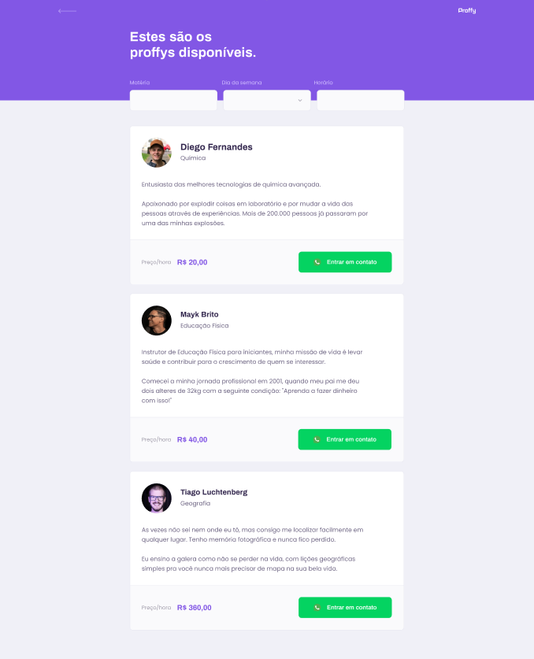

<h1 align="center">
  
</h1>

## :computer: Project:
Possibilita a conexão entre alunos e professores.

## :sparkles: Technologies Used:
- HTML
- CSS
- Javascript
- Node: `npm init -y`
- Express: `npm install express`
- Nodemon: `npm install nodemon -D`
- Nunjucks: `npm install nunjucks`
- SQLite: `npm install sqlite-async`

## :hammer_and_wrench: Features:
- Declarando variaveis em CSS
- HTML dinâmico usando nunjucks
- Banco de dados relacional com SQLite

## :scroll: Interesting References:
- Possiblidade de criar outros temas de cores usando variáveis CSS.
- Duplicando elementos HTML usando o querySelector do JS.
- Para criar um arquivo .sqlite novo é só rodar o db.js pelo terminal usando `node .\src\database\db.js`
- Visualização do Banco de Dados com a extensão SQLite do VSCode.

## :rocket: Getting Started (running the application):
#### On your local machine:
1. Clone the repository to your local machine using `git clone git@github.com:Paulo-Krg/NLW2_Javascript_Proffy.git`
1. Run `npm install` to install project dependencies
1. Run `npm run dev` to start the dev server
1. (which in turn will run the script configured in package.json: `nodemon src/server.js`)
1. Open your web browser at http://localhost:3333/

#### In your web browser:
1. Open the Gitpod link: https://gitpod.io/#https://github.com/Paulo-Krg/NLW2_Javascript_Proffy
1. Click `Open Preview` or `Open Browser` in the notification popup
1. Don't forget to <strong>Stop the Workspace</strong> when you leave!

## :bookmark: Layout:
You can view the project layout through [this link](https://www.figma.com/file/GHGS126t7WYjnPZdRKChJF/Proffy-Web?node-id=0%3A1).
 You must have a [Figma](http://figma.com/) account to access it.

## 📄 License:
This project is under the MIT license. See the [LICENSE](LICENSE) file for more details.
 

  <small>
    Projeto desenvolvido durante a trilha Discovery do evento Next Level Week #02 - Agosto/2020
  </small>

  

